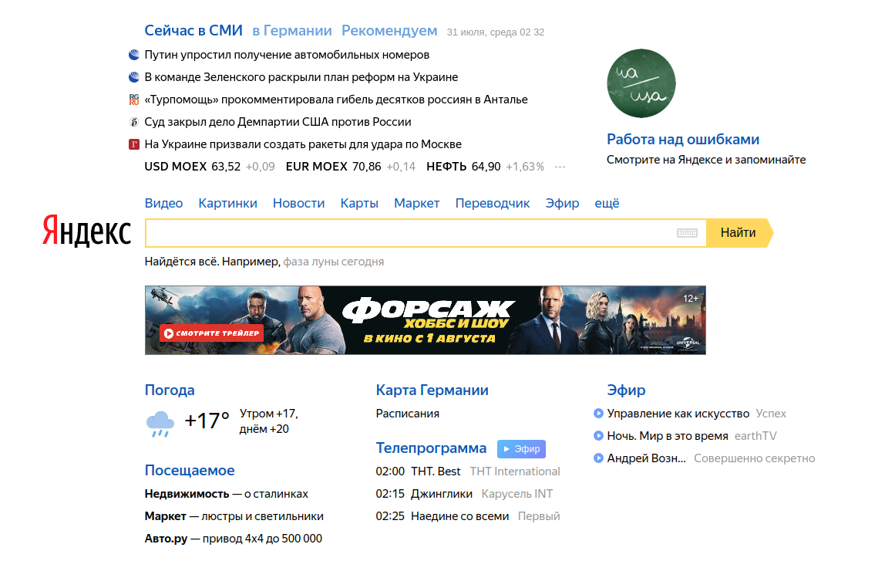

Декомпозиция
===

Вы работаете в стартапе, который решил тягаться с самим Яндексом в части предоставления контента. Это, конечно же, шутка, но задача нешуточная.

Вам принесли дизайн-макет, похожий на этот:

Что вам нужно сделать:

1. Разбейте весь интерфейс на компоненты и в файле каждого компонента напишите буквально одну строку комментария, за что данный компонент отвечает

Функциональность и стилизацию реализовывать не нужно, достаточно базового оформления, чтобы видно было все блоки.
